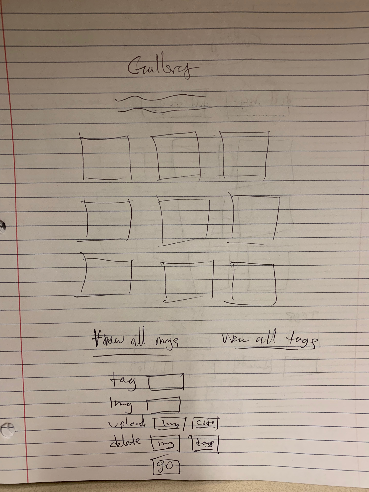
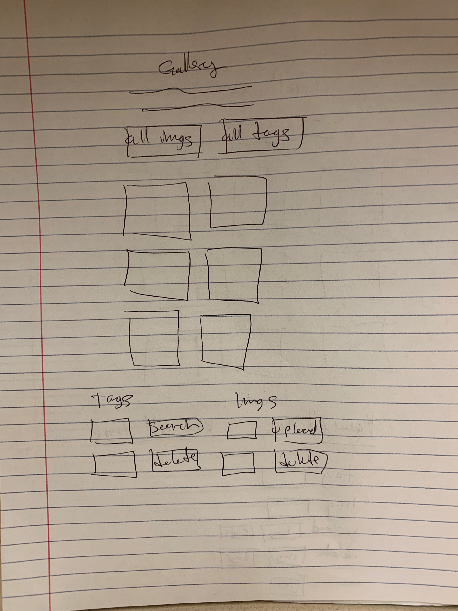
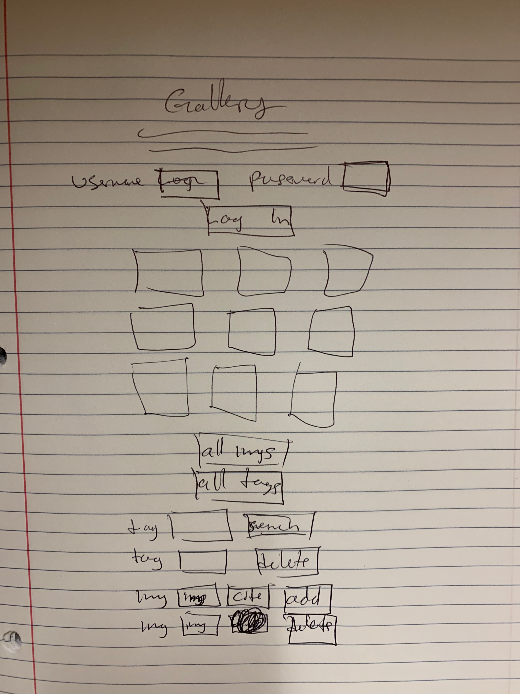
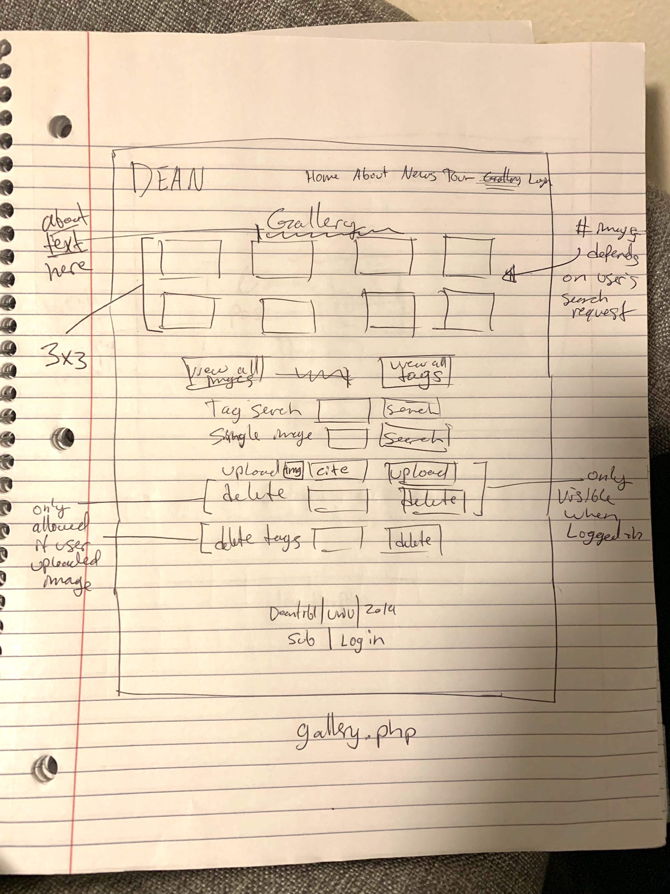
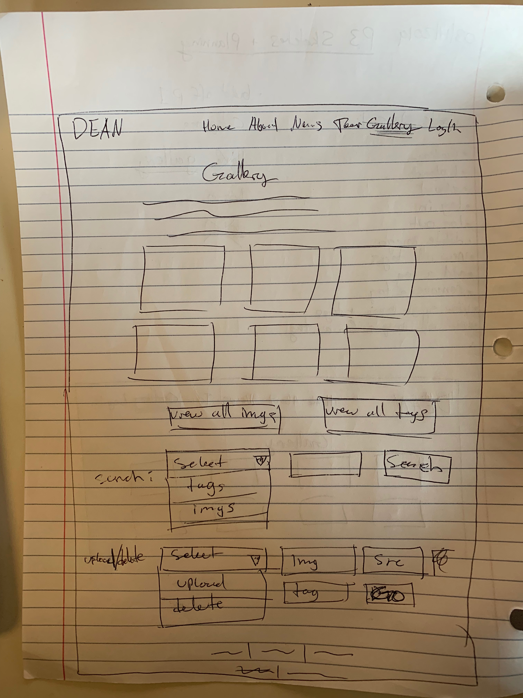
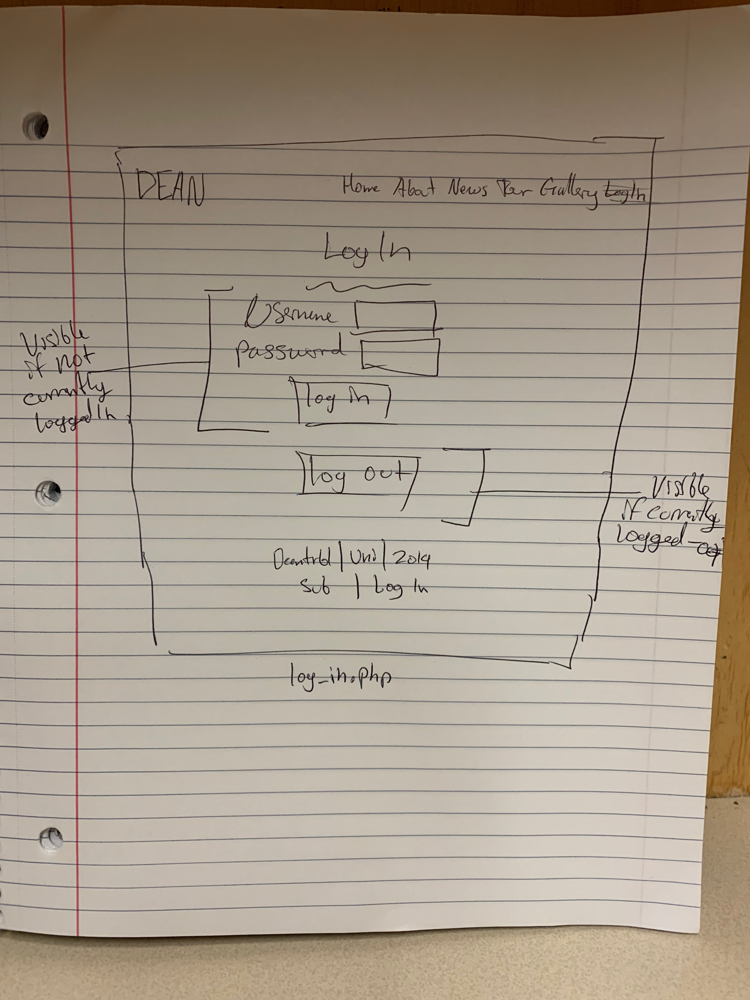
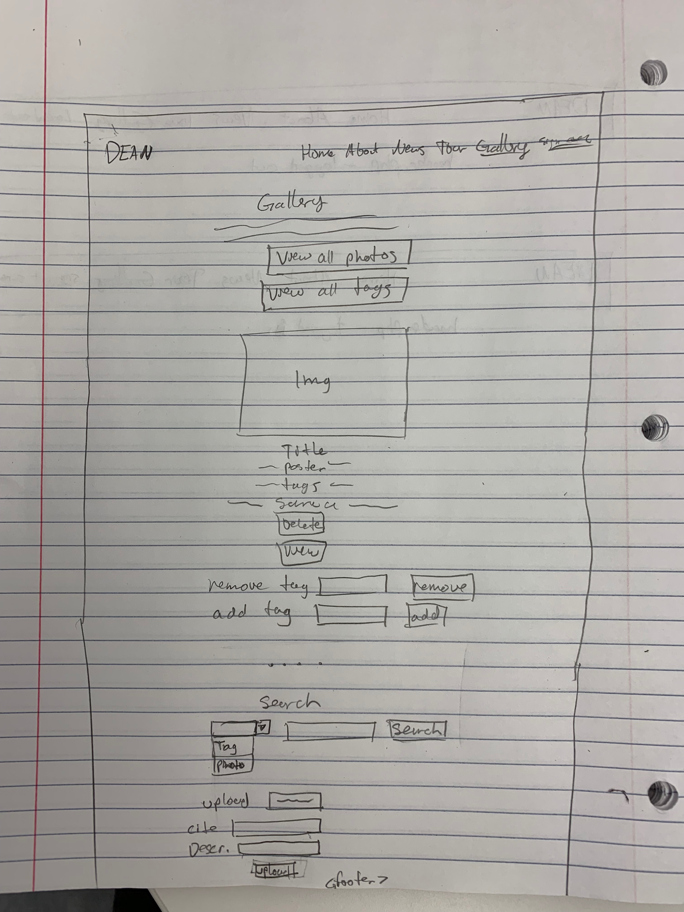
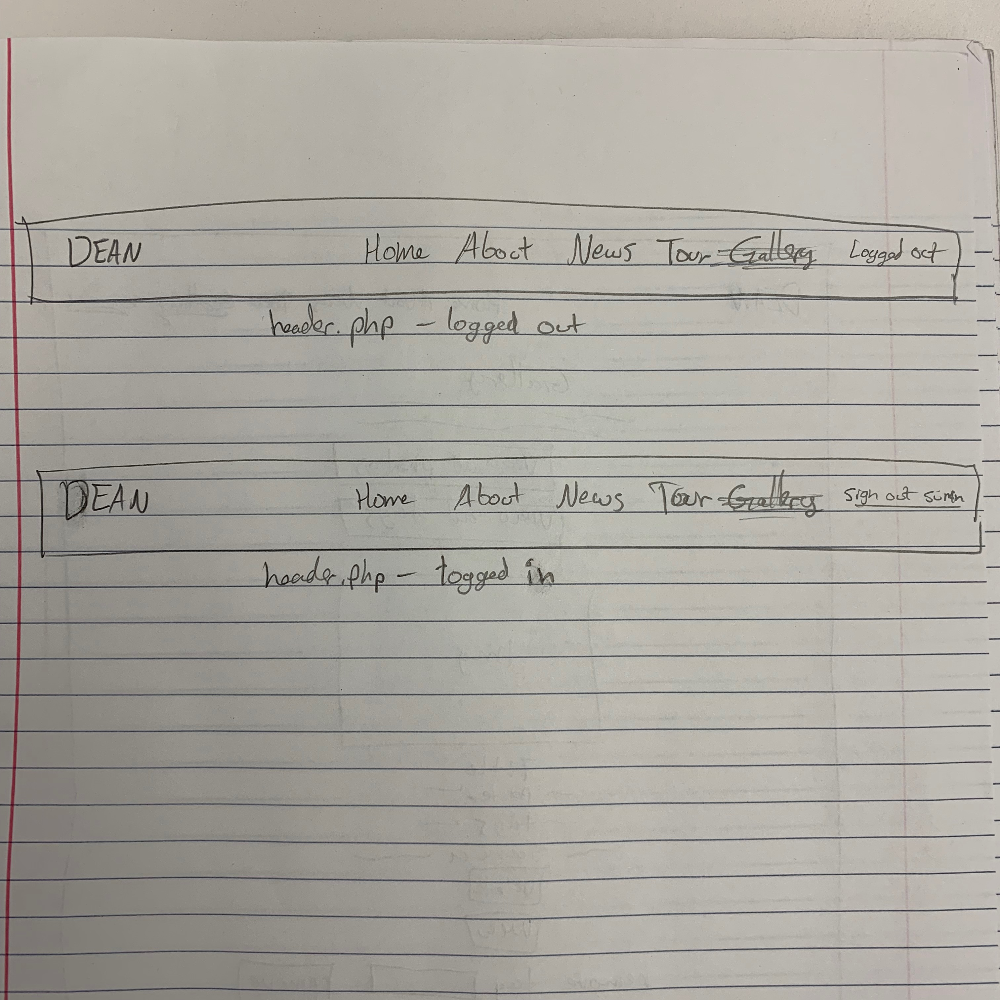

# Project 3: Design Journey

Your Name: Jacob Bee Ho Brown

**All images must be visible in Markdown Preview. No credit will be provided for images in your repository that are not properly linked in Markdown. Assume all file paths are case sensitive!**


# Project 3, Milestone 1 - Design, Plan, & Draft Website

## Describe your Gallery

[What will your gallery be about? 1 sentence.]
It will be a collection of photos of the R&B singer/rapper Dean.


## Target Audiences

[Tell us about your target two audiences. ~1-3 sentences per audience]

Target audience 1: Fans of Dean who want to keep up to date with current news and announcements about him. Fans will be interested in seeing pictures of Dean in the gallery of images and searching for specific images of him. They may also have images they have taken or found of him that they want to upload and share with other fans.


Target audience 2: R&B/Korean music  fans who do not know about Dean but want to learn more about him. They may be interested in seeing images of Dean and events he has been at to get a better sense of what kind of artist and person Dean and what kinds of performances he holds and attends. This website will have enough information and media for this audience to learn about Dean without having to visit many different websites.

## Design Process

[Document your design process. Show us the evolution of your design from your first idea (sketch) to design you wish to implement (sketch). Show us the process you used to organize content and plan the navigation (e.g. card sorting).]

[Label all images. All labels must be visible in Markdown Preview.]

[This builds off of Project 1. The new pages added for Project 3 are "gallery.php" and "log_in.php"]


^Initial page card sort


^Modified page card sort. Got rid of upload form.


^Gallery design 1. Initial design.


^Gallery design 2. Narrower gallery, more condensed.


^Gallery design 3. With log in form on top of page.


^Gallery design 4. Wider gallery (still 3 columns), more detailed labeling.


^Gallery design 5. Search and upload/delete using drop down options.


^log_in.php page


^Gallery design 6. Only one column of images because vertical height on images is not uniform. Better this way.


^new header.php

## Final Design Plan

[Include sketches of your final design here.]


gallery.php page


new header.php


## Templates

[Identify the templates you will use on your site.]

Template 1: header/navigation bar with links to Home, About, News, Tour, Gallery pages. It will say 'Logged Out' if no user is logged in and will have a button to log out if a user is logged in.

Template 2: footer with a link to subscribe and credits to the artist and his label.


## Database Schema Design

[Describe the structure of your database. You may use words or a picture. A bulleted list is probably the simplest way to do this. Make sure you include constraints for each field.]

[Hint: You probably need `users`, `images`, `tags`, and `image_tags` tables.]

[Hint: For foreign keys, use the singular name of the table + _id. For example: 1) `user_id` in the `images` table or 2) `image_id` and `tag_id` for the `image_tags` table.]

```sql
users (
id : INTEGER {PK, U, Not, AI} -- surrogate primary key
username : TEXT {U, Not}
password: TEXT {Not}
)

images (
id : INTEGER {PK, U, Not, AI} -- surrogate primary key
image : TEXT {U, Not}
citation: TEXT {Not}
file extension: TEXT {Not}
description: TEXT {Not}
user_id: TEXT {Not}
image_tag_id: TEXT {}
)

tags (
id : INTEGER {PK, U, Not, AI} -- surrogate primary key
tag1 : TEXT {}
tag : TEXT {}
tag : TEXT {}
)

image_tags (
id : INTEGER {PK, U, Not, AI} -- surrogate primary key
image_id: TEXT {Not}
tag_id: TEXT {Not}
)
```

## Code Planning

[Plan what top level PHP pages you'll need.]

[updated for final submit]

[old pages]
- index.php
- about.php
- news.php
- tour.php

[new pages]
- gallery.php: will have the gallery of images, will allow the user to filter through images by image or tags, upload and delete images if logged in and has persissions necessary.


[Plan what templates you'll need.]
[modified templates from Project 1]

- header.php: the nav bar with links: DEAN (index.php), Home (index.php), About (about.php), News (news.php), Tour (tour.php), Gallery (gallery.php), Log In (log_in.php) and will highlight the page that the user is currently on. Will also have a button to log out if currently logged in/notice that user is logged out if logged out.
- footer.php: will include brief information about the artist's name, his record label's name, the date the site was last updated, a link to subscribe to the newsletter, and a link to the log in page.
- login-logout.php: will be a form for user to log in with username and password. Will be placed on every page.

[Plan any PHP code you'll need.]

```sql
function user_logged_in() {
  if user is logged in, return true
  otherwise, return false
}

// Show logout, only if user is logged in.
if user is logged in (user_logged_in()) then
  show logout link
else
  show login link
end

// Allow user to upload, only if user is logged in.
if user is logged in (user_logged_in()) then
  allow them to upload photo
else
  do not allow them to upload photo
end


function posted_by_user(user=user) {
  if user posted the photo, return true
  otherwise, return false
}

// Allow user to delete, only if user posted the photo.
if user is the original poster of the photo (user_logged_in() and user_logged_in()) then
  allow them to delete photo/tags
else
  do not allow them to delete photo/tags
end


// if view all images clicked, display all images
if isset(view all images) then
  display all images


// if view all tags clicked, display all tags
if isset(view all tags) then
  display all tags


// check is image/tag search is valid
if isset(photo/tag search) then
  filter input
  if search type is valid
    search type = search type selected
else
  invlaid search

// make image/tag search query
if (valid search) then
  make SQL query with search parameters
esle:
  invlaid search


// check is post/delete is valid
if isset(post) then
  filter input
  if search type is valid
    post type = post type selected (upload/delete)
else
  invlaid post

// make post/delete query
if (post) then
  make SQL query with post parameters
esle:
  invlaid post
```


## Database Query Plan

[Plan your database queries. You may use natural language, pseudocode, or SQL.]

[updated for final submit]

Find all photos:
```sql
SELECT images.file_name from images
```

Find current photo:
```sql
SELECT * FROM images WHERE images.id = $image_id_to_view
```

Find all tags:
```sql
SELECT * FROM tags
```

Find all photos with tag 'neon':
```sql
SELECT images.file_name from images INNER JOIN tags, image_tags ON images.image_tag_id = image_tags.id AND image_tags.tag_id = tag.id WHERE tag.id LIKE 'neon'
```

Find all photos with tag user searched for:
```sql
SELECT * FROM images LEFT OUTER JOIN tags, image_tags ON image_tags.image_id = images.id AND image_tags.tag_id = tags.id WHERE " . $search_field . ".tag" . " LIKE '%' || :search || '%'
```

Find all tags for current image:
```sql
SELECT * FROM tags LEFT OUTER JOIN images, image_tags ON image_tags.image_id = images.id AND image_tags.tag_id = tags.id AND images.id = $current_image_id
```

Find all photos with description containing the word 'microphone':
```sql
SELECT images.file_name from images WHERE images.description LIKE 'microphone'
```

Find all photos with description user searched for:
```sql
SELECT * FROM images WHERE " . $search_field . ".description" . " LIKE '%' || :search || '%'
```

Upload image:
```sql
INSERT INTO images (file_name, citation, file_ext, description, user_id) VALUES (:filename, :citation, :extension, :description, :user_id)
```

Insert new tag:
```sql
INSERT INTO tags (tag) VALUES (:tag_to_add)
```

Get id of tag:
```sql
SELECT tags.id FROM tags WHERE " . "tags.tag" . " LIKE '%' || :tag_to_add || '%'
```

Insert tag id and image id into image_tags:
```sql
INSERT INTO image_tags (image_id, tag_id) VALUES (:current_image_id, :id)
```

Find image with certain tag:
```sql
SELECT * FROM image_tags WHERE image_tags.image_id = $current_image_id AND image_tags.tag_id = $old_tag_id
```

Delete image:
```sql
DELETE FROM images WHERE images.id = $image_to_delete
```

Delete tags connected to image:
```sql
DELETE FROM image_tags WHERE image_tags.image_id = $image_to_delete
```


# Project 3, Milestone 2 - Gallery and User Access Controls

## Issues & Challenges

[Tell us about any issues or challenges you faced while trying to complete milestone 2. 2-4 sentences/bullet points]

- Challenge: having to look up all of the PHP functions to realize what they are doing i.e. not realizing that password_verify only works on hashed passwords and not realizing that it was causing login to not work correctly.

- keeping track of all of my previous code. I forgot that I requires image names to be uniqie, and while testing uploading the same (3) images, the gallery page would go blank on submission. I thought it was a problem with the code so I spent a lot of time trying to fix it. I realized what the problem was after looking at the PHP server output messages.

- Working with multiple, related includes and learning how they can work with each other while being separate.

- Having to change my website design after realizing what is feasible and makes sense while implementing the site and its features.


# Final Submission: Complete & Polished Website

## Reflection

[Take this time to reflect on what you learned during this assignment. How have you improved since starting this class? 2-4 sentences]
This assignment helped me learn more about design organization of my code and my database structure. During the assignment, I realized that I needed to re-design the tagging structure in my database, that I needed to re-design the image gallery display, and I realized that some of my repetitive code could be put into an include file (which I ended up not doing). Additionally, this assignment helped me improve my logic when coding the site with PHP and I am now able to do more technical things with the website than I was during previous assignments.
